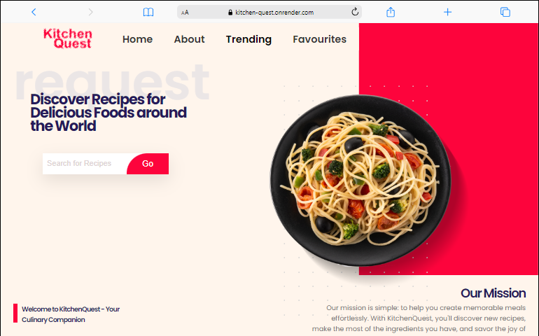
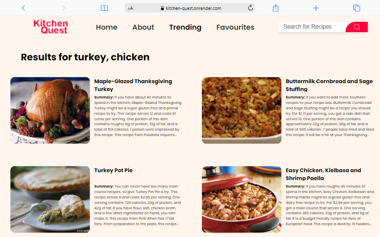
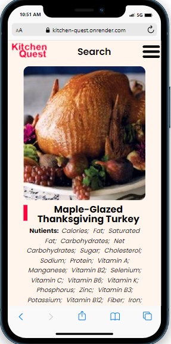

# KitchenQuest
KitchenQuest aims to solve the challenge of deciding what to cook based on the ingredients available to users. Often, people find themselves with a collection of ingredients but lack the inspiration to create a meal. This application will bridge that gap by suggesting recipes that can be prepared using the ingredients the user already has. 

But we didn't stop there. We also understand the importance of dietary preferences. Whether you're a vegetarian, following a Ketogenic diet, or need gluten-free options, we've got you covered. With KitchenQuest, you can search for recipes based on your preferences, and we'll provide you with a tailored list of delicious options. It's designed to streamline the cooking process, reduce food waste, and offer creative culinary options even when faced with limited ingredients.

### link to website:
[Kitchen](Kitchen-quest.onrender.com)

## Functional requirements:
- User authentification: Users will be allowed to log in / register with Google social media authentification. Users are only required to log in / register while saving a recipe. Or adding missing ingredients to their shopping lists.
- Recipe Search: Users can search for any recipe based on the provided list of ingredients. 
- Filter: Users can filter search results based on cuisines, dietary preferences, cooking time
- Recipe Details: Users can view detailed information about a recipe including ingredients, instructions, preparation time, and the nutritional information
- Save/Favorite: Users should be able to save recipes they like and mark them as favorites for easy access
- Shopping List: Users can add missing ingredients from a selected recipe to a shopping list for future reference
- User profile: Users should have a profile section where they can manage their account settings
- Social Sharing: Users can share recipes they like on social media platforms or through messaging apps.

### Introduction of team members:
- Ojulari Mistura[Linkedin]('https://www.linkedin.com/in/ojulari-mistura-0652ab151/')
- Onwuka Chukwuebuka[Linkedin]('www.linkedin.com/in/nathan-88-ebu')
- Adeyemo Wonderful [Linkedin]('https://www.linkedin.com/in/wonderful-adeyemo-oluwadara/')

